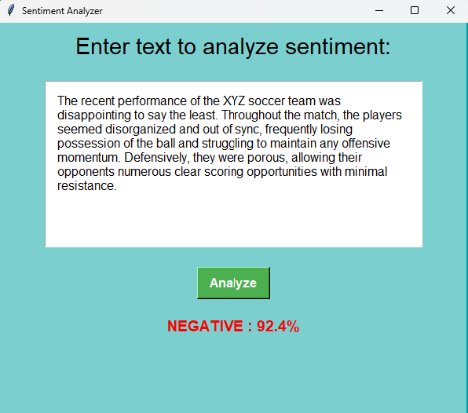

<!-- PROJECT LOGO -->
<br />
<div align="center">
  <h1 align="center">Fine Tuning BERT For Sentiment Analysis Using LoRA</h1>
</div>

<!-- ABOUT THE PROJECT -->
## About The Project

This project features a fine-tuned BERT model (Bidirectional Encoder Representations from Transformers) designed for sentiment analysis. It uses LoRA (Low Rank Adaptation) to make the model faster and more efficient. LoRA helps reduce the time it takes to fine tune the model without losing accuracy. 

Sentiment analysis, also known as opinion mining, involves determining the emotional tone behind a series of words to understand the attitudes, opinions, and emotions expressed in an online mention. My BERT model excels in understanding emotions expressed in text, making it reliable and effective for a wide range of uses with high accuracy.

Additionally, the project includes a simple GUI application that allows users to easily analyze the sentiment of an input sentence.

<table align="center">
  <tr>
    <td align="center">
      <br />
      <b>Positive</b>
    </td>
    <td align="center">
      <br />
      <b>Negative</b>
    </td>
  </tr>
</table>


The primary goal of this model is to classify reviews as positive or negative, helping businesses and individuals understand customer feedback and opinions more efficiently and accurately.

Model use dataset of IMDB movie reviews: [IMDB Dataset](https://huggingface.co/datasets/stanfordnlp/imdb)

Based BERT Model: [BERT Model](https://huggingface.co/google-bert/bert-base-cased)

Accuracy: more than 90%

## Installation

1. Clone the repository
   ```sh
   git clone https://github.com/trungmac07/Bert_Fine_Tuning_Sentiment_Analysis.git
   ```
2. Install related packages
    ```sh
    pip install -r requirements.txt
    ```

## Usage
### 1. Training

Because of the limitations of devices in training, fine tuning the model takes a long time. To manage this, train the model in parts, saving and loading it between sessions. Look for two training guides in the "notebook" folder.

- `begin_fine_tuning.ipynb`: notebook for training from beginning
- `continue_fine_tuning.ipynb`: notebook for continuing training after 

### 2. GUI application
Execute the command below. The application will open with a white box for entering review sentences. Click the button to analyze the sentence and view the prediction results with percentages.

```sh
   python.exe Sentiment_Analysis.py
```

## Contact
- Email: mttrung16@gmail.com 


